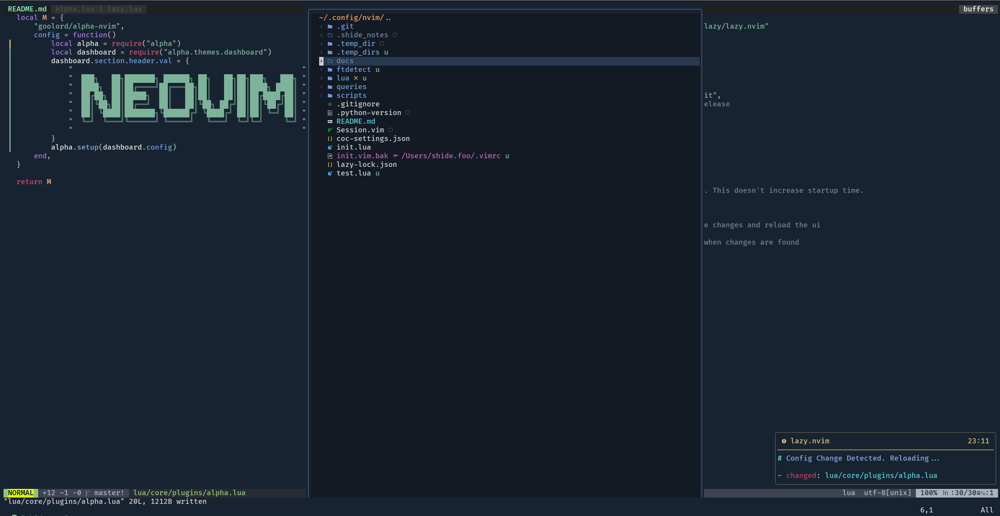

<h1 align="center">My Nvim Configuration</h1>

My nvim configs inspired by https://github.com/Allaman/nvim. I decided that my neovim configurations needed an upgrade, so this is a refresh to port everything over to lua.
Some options are still configured using vimscript, but the rest of the plugins are configured in lua. This is a work in progress.

## Features
---
### General
* Plugin management using [Lazy](https://github.com/LazyVim/LazyVim)
* Terminal integration via [nvim-toggleterm](https://github.com/akinsho/toggleterm.nvim)
* Git automation using [fugitive](https://github.com/tpope/vim-fugitive), [gitsigns](https://github.com/lewis6991/gitsigns.nvim), [gitlinker](https://github.com/ruifm/gitlinker.nvim), [octo](https://github.com/pwntester/octo.nvim)
* Tree explorer using [nvim-tree](https://github.com/nvim-tree/nvim-tree.lua)
* Async job handler using [vim-dispatch](https://github.com/tpope/vim-dispatch)
* [Telescope](https://github.com/nvim-telescope/telescope.nvim) for finding files & text
* Status bar using [vim-airline](https://github.com/vim-airline/vim-airline)
* Fancy notifications via [nvim-notify](https://github.com/rcarriga/nvim-notify)
* Zen mode using [goyo](https://github.com/junegunn/goyo.vim)

### Coding
* Completion engine using [coc-nvim](https://github.com/neoclide/coc.nvim)
* Linting and Fixing by [ALE](https://github.com/dense-analysis/ale)
* Enhanced highlighting using [nvim-tree-sitter](https://github.com/nvim-treesitter/nvim-treesitter)
* Go code tools for extra go functions like GoRename via [vim-go](https://github.com/fatih/vim-go)
* Package management for linters, lsps, formatters via [Mason](https://github.com/williamboman/mason.nvim#installation)

### Funky addons
* [Modulating theme](https://github.com/shydefoo/nvim/blob/735b01876f34ecb505be7add247dca43825f4e82/lua/core/plugins/themes/modulating.lua#L1) based on the time of the day. I used different themes from [nightfox](https://github.com/EdenEast/nightfox.nvim) to change my colorscheme automatically without having to restart neovim. This seems to work as of now.

